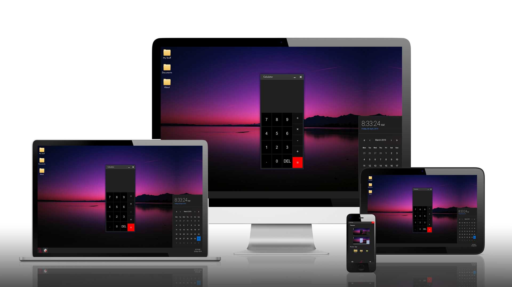

# Eleven Windowns Portfolo Website

### Live Demo

[http://eleven-windows.andreinedelus.ro](http://eleven-windows.andreinedelus.ro)



### About

-   Windows experience in the browser
-   Implemented responsive design
-   Added animations
-   Easy to add more apps

### Apps

##### 1. Neighborhood Map

-   Built with google-maps-react npm library.
-   Used Foursquare API to get the address of each location.

##### 2. Memory Game

-   If you get bored on my site, try playing a game. :)

##### 3. Calculator

-   Simple calculator that solve an operation between two numbers.

##### 4. Settings

-   Change the windows theme, dark or light.
-   Change the windows size from a preset list of three sizes.

##### 5. Calendar

-   Basic calendar that shows the days of the month.

##### 6. Weather

-   Under construction

### Routing

#### Desktop

-   All apps opens on the same route **'/apps'**

#### Mobile

-   Each app opens on its own route **'/apps/#appName'**, multitasking not possible on mobile.

### How to run

-   Before running create a .env file in root folder of the project
-   Paste the following code with your own API Keys

| Variable Name                      | API / Information     |
| ---------------------------------- | --------------------- |
| REACT_APP_GOOGLE_MAPS_API          | Your own API Key      |
| REACT_APP_FOURSQUARE_CLIENT_ID     | Your own API Key      |
| REACT_APP_FOURSQUARE_CLIENT_SECRET | Your own API Key      |
| REACT_APP_PHONE_NUMBER             | Your own informations |
| REACT_APP_EMAIL_ADDRESS            | Your own informations |

```sh
$ cd eleven-windows-portfolio-site
$ npm install
$ npm start
```
